rpi-dashboard
=============

A dashboard for Raspberry Pi using Duda I/O.

Raspberry Pi Dashboard:
- is a web based dashboard for monitoring and controlling your Raspberry Pi
- shows information about CPU, memory, network and storage
- is open source, licensed under [Apache License v2.0](http://www.apache.org/licenses/LICENSE-2.0.html). All code is available in [github repository](https://github.com/matematik7/rpi-dashboard)
- uses a lightweight [Monkey](http://monkey-project.com/) web server and [Duda I/O](http://duda.io/) framework for backend and AngularJS, jQuery, Bootstrap and Google Charts for frontend
- was developed as part of [Google Summer of Code](https://www.google-melange.com/gsoc/homepage/google/gsoc2014)

Documentation with installation instructions: [gitbooks](https://matematik7.gitbooks.io/rpi-dashboard-docs/content/)

## Features:

- Simple user login configuration
- CPU, memory, network and storage metrics
- Logging of metrics for hour, day, week, month and year intervals
- REST api
- jQuery plugin library
- AngularJS one page Dashboard
- GPIO view and control (input, output, PWM, tone)
- I2C, SPI and serial support
- Shifting 8-bits in/out on two pins
- WebSocket support for GPIO and serial
- Modular main page on dashboard

## Screenshots:

### Login screen
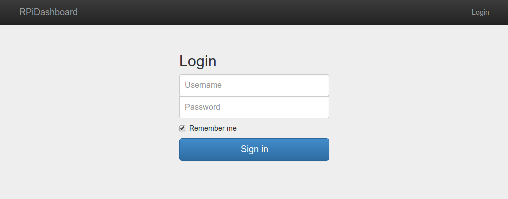

### Main dashboard page
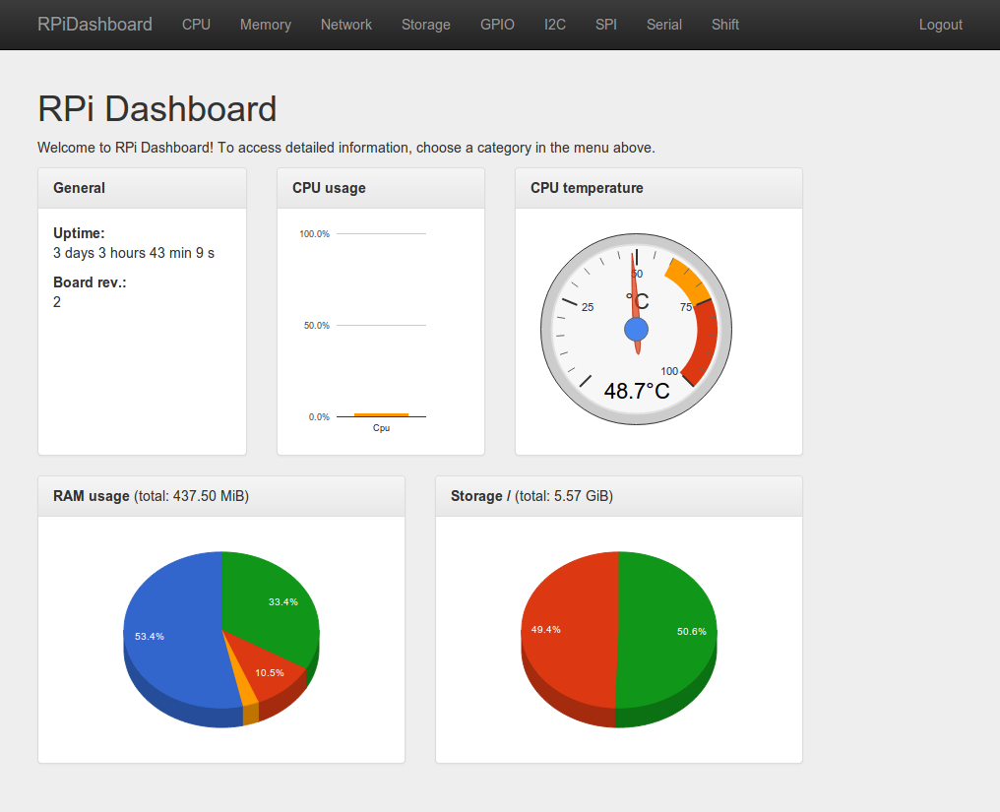

### Page with cpu information
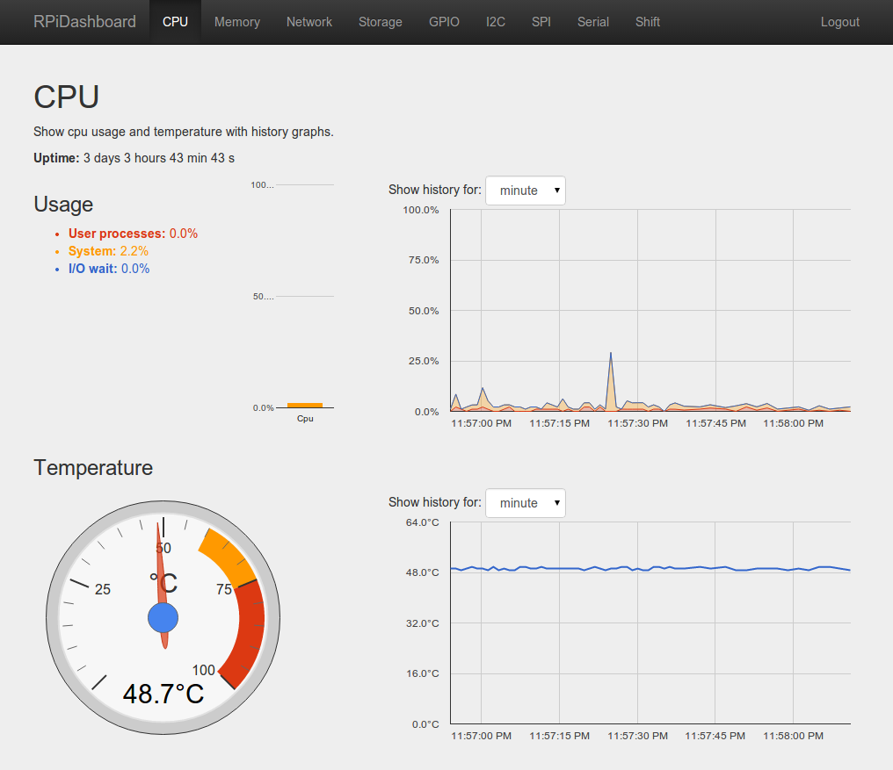

### Page with information about ram and swap
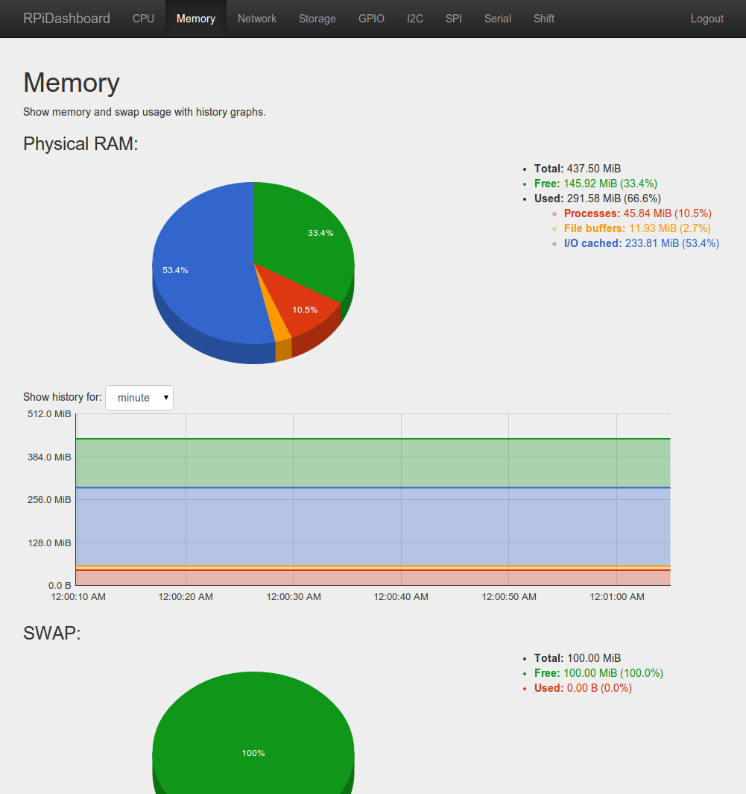

### Page with network information
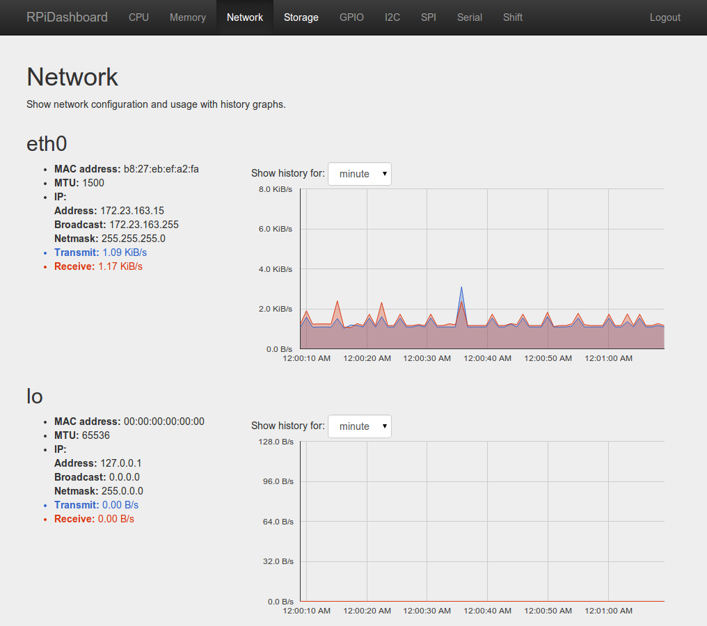

### Page with information about storage
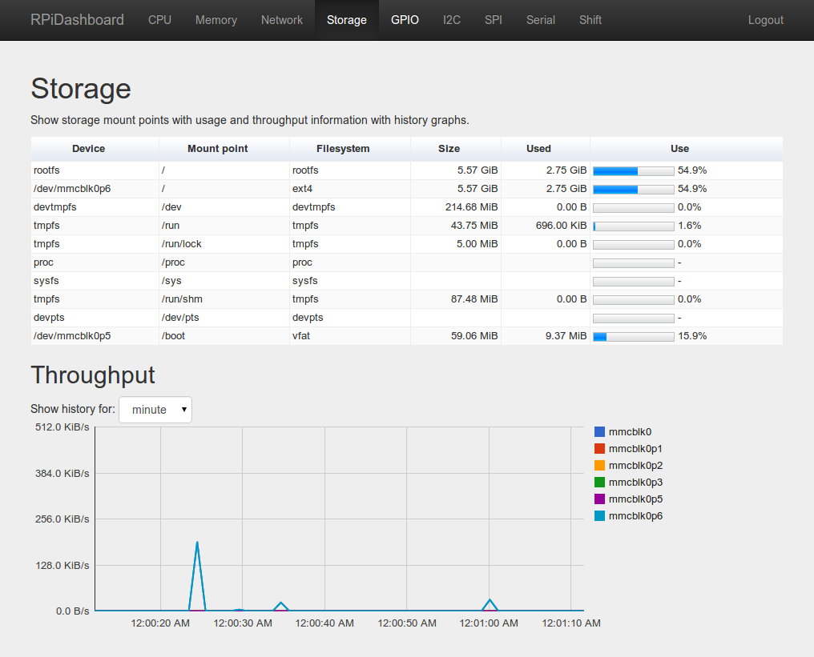

### Page with GPIO control
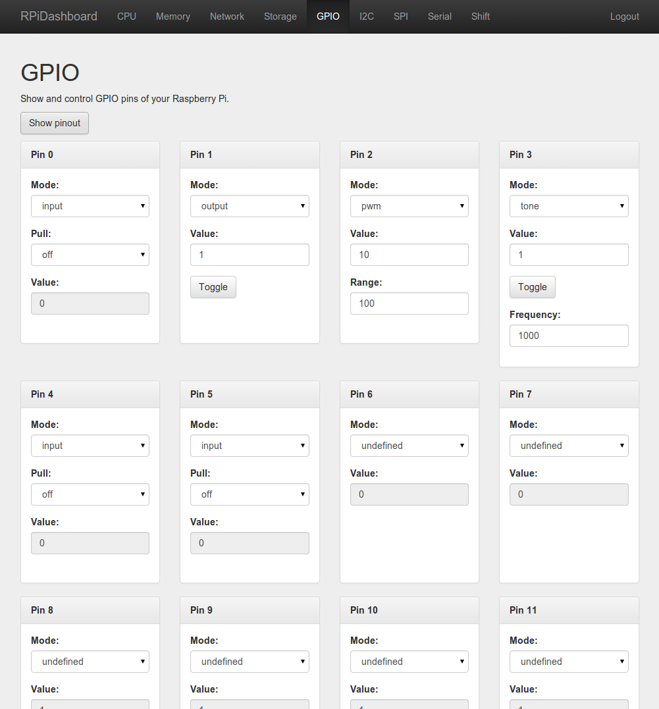

### GPIO page with pinout shown
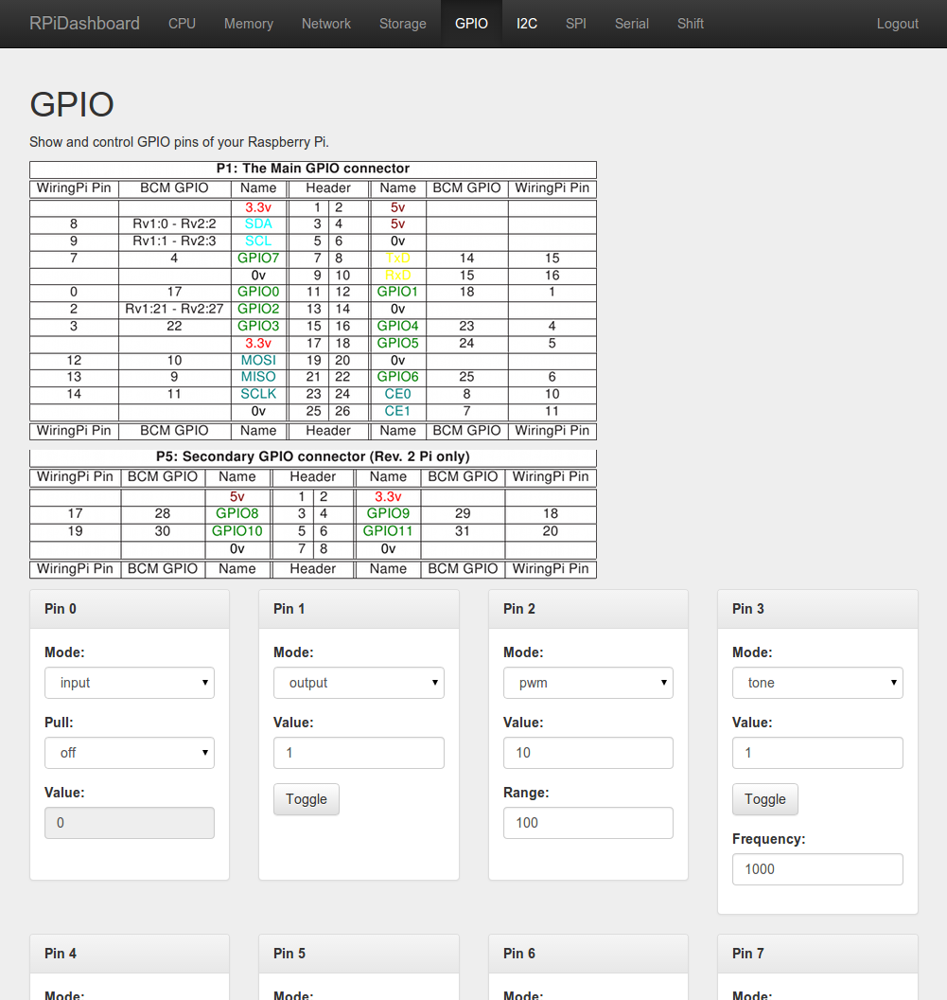

### Page with i2c control
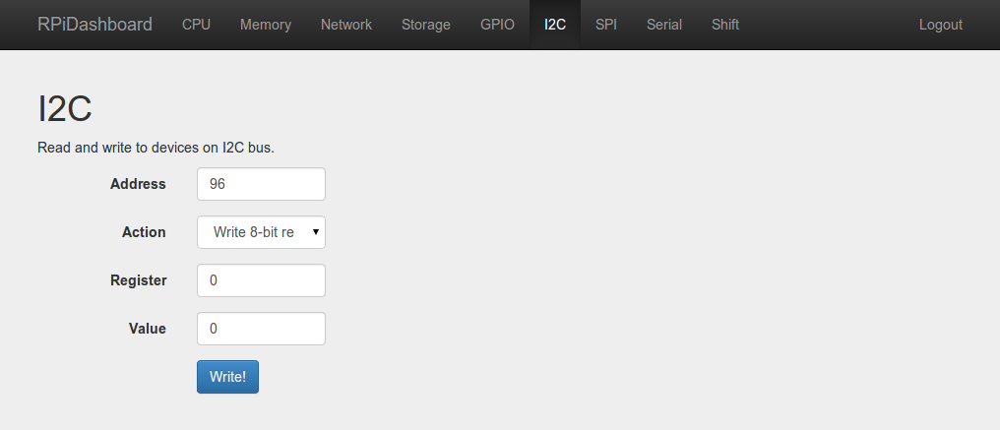

### Page for SPI control
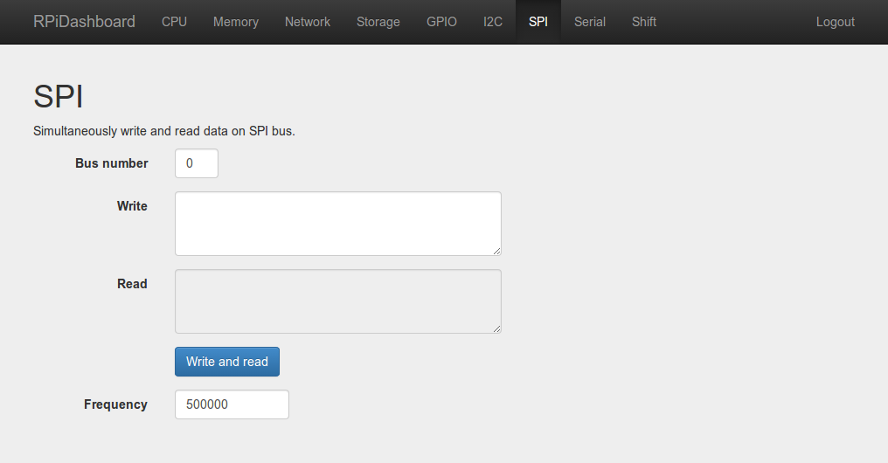

### Page for serial communication
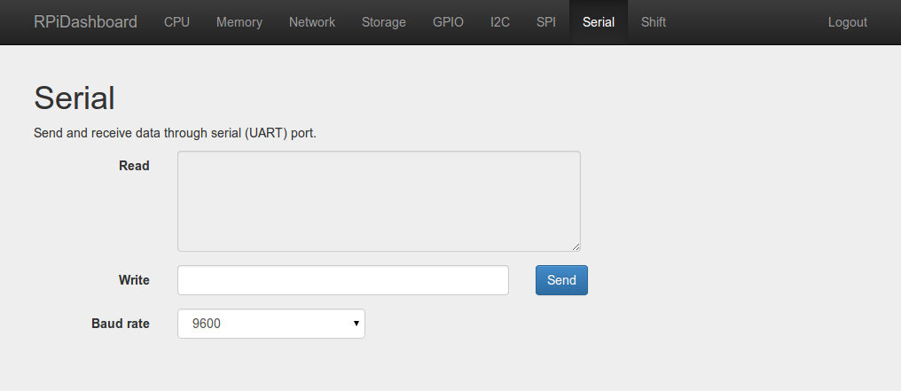

### Page for shift control
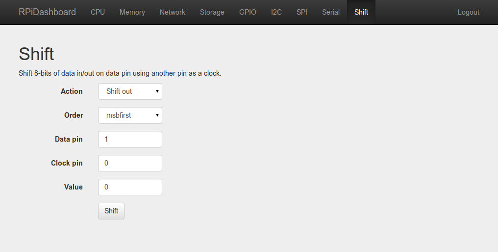

